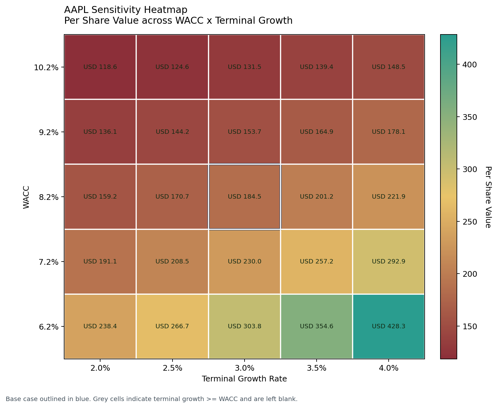
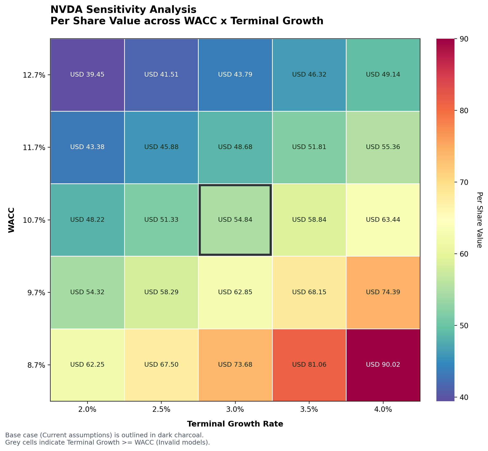
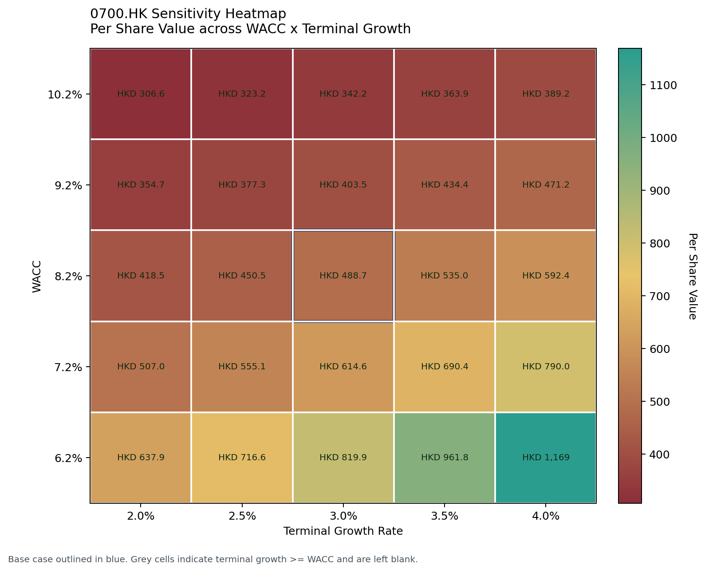
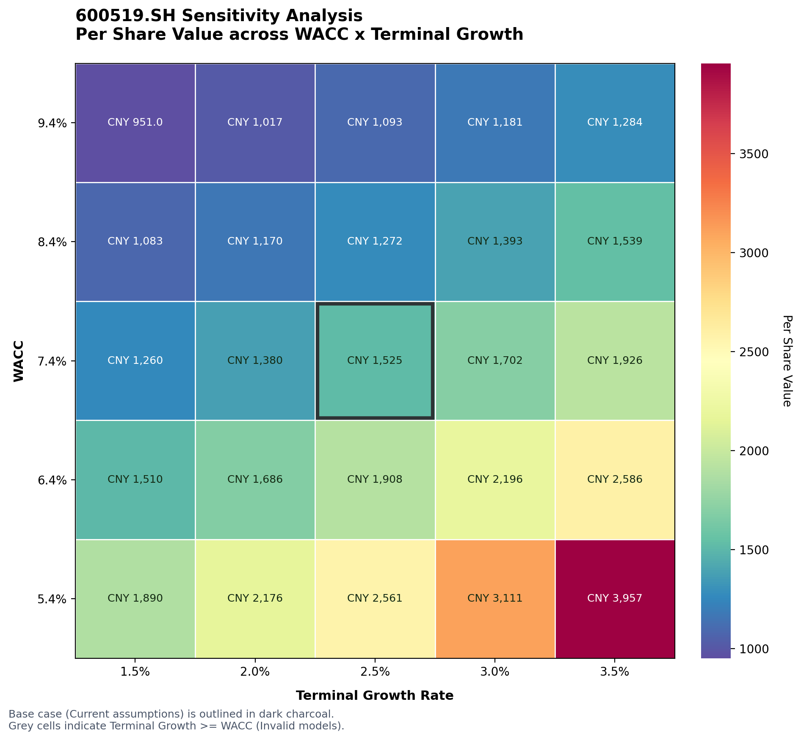

# FP-DCF

[English](./README.md) | [简体中文](./README.zh-CN.md)

A first-principles DCF engine for LLM agents and quantitative research workflows.

FP-DCF turns normalized public-company data into auditable `FCFF`, `WACC`, valuation, implied-growth, and sensitivity outputs without hiding accounting and valuation assumptions behind opaque shortcuts.

> Repository workflow note: GitHub submissions for this project do not use a separate feature-branch workflow. Commit and publish on the designated branch directly unless the maintainer explicitly says otherwise.

Representative market-implied sensitivity heatmaps:

| Apple two-stage | NVIDIA three-stage |
| --- | --- |
|  |  |

## Quickstart

Install and run the sample in one go:

```bash
python3 -m pip install .
python3 scripts/run_dcf.py --input examples/sample_input.json --pretty
```

This returns structured JSON and, by default, auto-renders `png/svg` sensitivity heatmaps.

## Who this is for

* agent / tool workflows that need machine-readable valuation output
* quantitative and discretionary research pipelines
* users who care about auditable `FCFF -> WACC -> DCF` logic
* downstream systems that need diagnostics, warnings, and source labels

## Not for

* portfolio optimization
* trade execution
* backtesting platforms
* black-box one-number valuation tools
* factor ranking systems unrelated to valuation

## Why FP-DCF

Unlike many open-source DCF scripts, FP-DCF:

* separates operating tax for `FCFF` from marginal tax for `WACC`
* uses an explicit `Delta NWC` hierarchy instead of hard-coding one noisy field
* supports traceable FCFF path selection (`EBIAT` vs `CFO`)
* supports normalized anchor modes (`latest`, `manual`, `three_period_average`, `reconciled_average`)
* emits diagnostics, warnings, and source labels in structured output

## What you get

* structured valuation JSON for `steady_state_single_stage`, `two_stage`, and `three_stage`
* unified market-implied growth via `market_implied_growth`
* `steady_state_single_stage` solves market-implied long-term growth; `two_stage` and `three_stage` solve market-implied stage-1 growth
* `WACC x Terminal Growth` sensitivity heatmaps
* provider-backed normalization with Yahoo plus CN fallback via AkShare + BaoStock
* machine-readable diagnostics for downstream tools
* explicit `requested_valuation_model` / `effective_valuation_model` output with no silent fallback on unknown `valuation_model`

## Sample output shape

```json
{
  "valuation_model": "three_stage",
  "requested_valuation_model": "three_stage",
  "effective_valuation_model": "three_stage",
  "valuation": {
    "present_value_stage1": 514861452010.8,
    "present_value_stage2": 285871425709.47,
    "present_value_terminal": 1539144808713.01,
    "terminal_value": 3095373176764.22,
    "explicit_forecast_years": 8
  },
  "diagnostics": ["valuation_model_three_stage"],
  "warnings": []
}
```

## Data Dictionary

The canonical JSON returned by `fp-dcf` is built from `ValuationOutput`. The main CLI may add `market_inputs`, `sensitivity`, and `artifacts` when those features are enabled.

### Top-level output

| Field | Type | Meaning |
| --- | --- | --- |
| `ticker` | string | Ticker symbol used for the run. |
| `market` | string | Market code such as `US` or `CN`. |
| `valuation_model` | string | Effective model executed. |
| `requested_valuation_model` | string \| null | Model requested before defaulting or validation. |
| `effective_valuation_model` | string \| null | Model actually used after validation and default handling. |
| `degraded` | bool | `true` when the run was structurally degraded. |
| `degradation_reasons` | list[string] | Machine-readable degradation reason keys. |
| `currency` | string \| null | Reporting currency if known. |
| `as_of_date` | string \| null | Valuation date attached to the output. |
| `tax` | object | Nested `TaxAssumptions` block. |
| `wacc_inputs` | object | Nested `WACCInputs` block. |
| `capital_structure` | object | Nested `CapitalStructure` block. |
| `fcff` | object | Nested `FCFFSummary` block. |
| `valuation` | object | Nested `ValuationSummary` block. |
| `market_implied_growth` | object \| null | Nested `MarketImpliedGrowthOutput` block, omitted when disabled. |
| `diagnostics` | list[string] | Machine-readable event codes. |
| `warnings` | list[string] | Non-fatal quality, defaulting, or fallback warnings. |

### Nested blocks

* `tax` (`TaxAssumptions`): `effective_tax_rate`, `effective_tax_rate_source`, `marginal_tax_rate`, `marginal_tax_rate_source`
* `wacc_inputs` (`WACCInputs`): `risk_free_rate`, `risk_free_rate_source`, `equity_risk_premium`, `equity_risk_premium_source`, `beta`, `beta_source`, `cost_of_equity`, `pre_tax_cost_of_debt`, `pre_tax_cost_of_debt_source`, `wacc`
* `capital_structure` (`CapitalStructure`): `equity_weight`, `debt_weight`, `source`
* `fcff` (`FCFFSummary`): `anchor`, `anchor_method`, `selected_path`, `anchor_ebiat_path`, `anchor_cfo_path`, `ebiat_path_available`, `cfo_path_available`, `after_tax_interest`, `after_tax_interest_source`, `reconciliation_gap`, `reconciliation_gap_pct`, `anchor_mode`, `anchor_observation_count`, `delta_nwc_source`, `last_report_period`
* `valuation` (`ValuationSummary`): `enterprise_value`, `equity_value`, `per_share_value`, `terminal_growth_rate`, `terminal_growth_rate_effective`, `present_value_stage1`, `present_value_stage2`, `present_value_terminal`, `terminal_value`, `terminal_value_share`, `explicit_forecast_years`, `stage1_years`, `stage2_years`, `stage2_decay_mode`
* `market_implied_growth` (`MarketImpliedGrowthOutput`): `enabled`, `success`, `valuation_model`, `solved_field`, `solved_value`, `solver_used`, `lower_bound`, `upper_bound`, `iterations`, `residual`, `market_price`, `market_enterprise_value`, `base_case_per_share_value`, `base_case_enterprise_value`, `message`
* `market_inputs` (`MarketInputsSummary`, CLI-added when market-implied growth is present): `enterprise_value_market`, `enterprise_value_market_source`, `equity_value_market`, `market_price`, `market_price_source`, `shares_out`, `shares_out_source`, `net_debt`, `net_debt_source`
* `sensitivity` summary (`SensitivityHeatmapOutput.to_summary_dict()`): `metric`, `metric_label`, `base_wacc`, `base_terminal_growth_rate`, `base_metric_value`, `market_price`, `wacc_axis`, `terminal_growth_axis`, `diagnostics`, `warnings`, and optional `grid` when `sensitivity.detail=true`
* `artifacts` (CLI-added when chart rendering succeeds): `sensitivity_heatmap_path`, `sensitivity_heatmap_svg_path`

### Standalone sensitivity CLI

The separate `fp-dcf-sensitivity` command returns the full `SensitivityHeatmapOutput` object, which contains:

* `ticker`
* `market`
* `valuation_model`
* `metric`
* `metric_label`
* `currency`
* `as_of_date`
* `base_wacc`
* `base_terminal_growth_rate`
* `base_metric_value`
* `market_price`
* `wacc_values`
* `terminal_growth_values`
* `matrix`
* `diagnostics`
* `warnings`

### Common codes

`diagnostics` and `warnings` are append-only machine-readable string arrays. Common examples include:

* `valuation_model_steady_state_single_stage`
* `valuation_model_two_stage`
* `valuation_model_three_stage`
* `fcff_path_selected:cfo`
* `fcff_path_selected:ebiat`
* `provider_cache_hit:yahoo`
* `provider_cache_miss:akshare_baostock`
* `provider_fallback:yahoo->akshare_baostock`
* `valuation_model_missing_defaulted_to_steady_state_single_stage`
* `capital_structure_weights_defaulted_to_0.7_0.3`
* `delta_nwc_missing_assumed_zero`
* `shares_out_missing_per_share_value_unavailable`

Current degradation reason keys are:

* `degraded_due_to_default_capital_structure`
* `degraded_due_to_assumed_zero_delta_nwc`
* `degraded_due_to_ebiat_only_fcff_anchor`
* `degraded_due_to_missing_shares_out`

### Files written to disk

* The main CLI writes the output JSON to `--output` or stdout.
* The main CLI also writes `*.sensitivity.svg` and `*.sensitivity.png` when sensitivity is enabled.
* Provider-backed normalization writes cache snapshots under `~/.cache/fp-dcf` by default, or under `XDG_CACHE_HOME/fp-dcf` when that environment variable is set.
* The standalone sensitivity CLI writes a JSON summary to `--json-output` and, when `--output` is provided, a rendered chart artifact.

See also:

* [sample_input.json](./examples/sample_input.json)
* [sample_output.json](./examples/sample_output.json)
* [sample_input_three_stage.json](./examples/sample_input_three_stage.json)
* [sample_output_three_stage.json](./examples/sample_output_three_stage.json)
* [sample_input_market_implied_growth_single_stage.json](./examples/sample_input_market_implied_growth_single_stage.json)
* [sample_output_market_implied_growth_single_stage.json](./examples/sample_output_market_implied_growth_single_stage.json)
* [sample_input_market_implied_growth_two_stage.json](./examples/sample_input_market_implied_growth_two_stage.json)
* [sample_output_market_implied_growth_two_stage.json](./examples/sample_output_market_implied_growth_two_stage.json)
* [sample_input_market_implied_growth_three_stage.json](./examples/sample_input_market_implied_growth_three_stage.json)
* [sample_output_market_implied_growth_three_stage.json](./examples/sample_output_market_implied_growth_three_stage.json)
* `300347.SZ` single-stage market-implied demo: [input](./examples/300347.sz_market_implied_growth_single_stage.json), [output](./examples/300347.sz_market_implied_growth_single_stage.output.json), [PNG](./examples/300347.sz_market_implied_growth_single_stage.output.sensitivity.png), [SVG](./examples/300347.sz_market_implied_growth_single_stage.output.sensitivity.svg)
* `300347.SZ` two-stage market-implied demo: [input](./examples/300347.sz_market_implied_growth_two_stage.json), [output](./examples/300347.sz_market_implied_growth_two_stage.output.json), [PNG](./examples/300347.sz_market_implied_growth_two_stage.output.sensitivity.png), [SVG](./examples/300347.sz_market_implied_growth_two_stage.output.sensitivity.svg)
* `300347.SZ` three-stage market-implied demo: [input](./examples/300347.sz_market_implied_growth_three_stage.json), [output](./examples/300347.sz_market_implied_growth_three_stage.output.json), [PNG](./examples/300347.sz_market_implied_growth_three_stage.output.sensitivity.png), [SVG](./examples/300347.sz_market_implied_growth_three_stage.output.sensitivity.svg)
* [cn_tencent_two_stage.json](./examples/cn_tencent_two_stage.json)
* [cn_tencent_two_stage.output.json](./examples/cn_tencent_two_stage.output.json)
* [cn_moutai_single_stage.json](./examples/cn_moutai_single_stage.json)
* [cn_moutai_single_stage.output.json](./examples/cn_moutai_single_stage.output.json)
* [AAPL_two_stage_manual_fundamentals_market_implied.json](./examples/AAPL_two_stage_manual_fundamentals_market_implied.json)
* [AAPL_two_stage_provider_market_implied.json](./examples/AAPL_two_stage_provider_market_implied.json)
* [NVDA_three_stage_manual_fundamentals_market_implied.json](./examples/NVDA_three_stage_manual_fundamentals_market_implied.json)
* [NVDA_three_stage_provider_market_implied.json](./examples/NVDA_three_stage_provider_market_implied.json)
* [Methodology](./references/methodology.md)
* [简体中文](./README.zh-CN.md)

## Regional samples

Tencent two-stage sample:

* input: [cn_tencent_two_stage.json](./examples/cn_tencent_two_stage.json)
* output: [cn_tencent_two_stage.output.json](./examples/cn_tencent_two_stage.output.json)
* heatmap PNG: [cn_tencent_two_stage.output.sensitivity.png](./examples/cn_tencent_two_stage.output.sensitivity.png)



Kweichow Moutai steady-state single-stage sample:

* input: [cn_moutai_single_stage.json](./examples/cn_moutai_single_stage.json)
* output: [cn_moutai_single_stage.output.json](./examples/cn_moutai_single_stage.output.json)
* heatmap PNG: [cn_moutai_single_stage.output.sensitivity.png](./examples/cn_moutai_single_stage.output.sensitivity.png)



AAPL / NVDA market-implied input samples. The hero heatmaps above use the `manual_fundamentals` runs:

* Apple two-stage, manual fundamentals: [AAPL_two_stage_manual_fundamentals_market_implied.json](./examples/AAPL_two_stage_manual_fundamentals_market_implied.json)
* Apple two-stage, provider fundamentals: [AAPL_two_stage_provider_market_implied.json](./examples/AAPL_two_stage_provider_market_implied.json)
* NVIDIA three-stage, manual fundamentals: [NVDA_three_stage_manual_fundamentals_market_implied.json](./examples/NVDA_three_stage_manual_fundamentals_market_implied.json)
* NVIDIA three-stage, provider fundamentals: [NVDA_three_stage_provider_market_implied.json](./examples/NVDA_three_stage_provider_market_implied.json)

## Positioning

This repository is the public-facing extraction layer for a larger Yahoo / market-data-based DCF workflow. It is intentionally narrower than a full research platform:

* It focuses on valuation logic, input / output contracts, and LLM-friendly packaging.
* It does not try to be a portfolio optimizer, execution engine, or backtesting system.
* It is meant to sit upstream of downstream ranking, portfolio construction, or agent orchestration layers.

## Core principles

### 1. Tax-rate separation

* `FCFF` should use the best available operating tax estimate, typically the reported effective tax rate from the statement set.
* `WACC` should apply a marginal tax assumption to the debt tax shield.
* If either rate is missing, the fallback source must be explicit in the output.

### 2. Robust Delta NWC handling

The intended hierarchy is:

1. `delta_nwc`
2. `OpNWC_delta`
3. `NWC_delta`
4. derived operating working capital from current assets / current liabilities
5. cash-flow statement fallback such as `ChangeInWorkingCapital`

The selected source should always be reported back to the caller.

### 3. Normalized FCFF anchors

For steady-state single-stage DCF:

* do not treat historical `FCFF` as future explicit forecast periods
* prefer a normalized steady-state anchor
* prefer `NOPAT + ROIC + reinvestment` when the required drivers are available
* fall back to normalized historical `FCFF` only when the operating-driver path is incomplete
* `assumptions.fcff_anchor_mode` defaults to `latest` and also supports `manual`, `three_period_average`, and `reconciled_average`
* provider-backed normalization exposes only the minimal historical series needed for those modes, using `date:value` dictionaries

### 4. Market-value-aware WACC

The intended `WACC` path is:

* risk-free rate
* equity risk premium
* beta / cost of equity
* pre-tax cost of debt
* market-value-based equity and debt weights
* explicit marginal tax shield on debt

## Executable entry points

Run with a complete structured input:

```bash
python3 scripts/run_dcf.py --input examples/sample_input.json --pretty
```

Or use the packaged CLI after installation:

```bash
fp-dcf --input examples/sample_input.json --pretty
```

If you only have a ticker and want the runner to fill missing valuation inputs from Yahoo Finance, start from:

```bash
cat > /tmp/fp_dcf_yahoo_input.json <<'JSON'
{
  "ticker": "AAPL",
  "market": "US",
  "provider": "yahoo",
  "statement_frequency": "A",
  "valuation_model": "steady_state_single_stage",
  "assumptions": {
    "terminal_growth_rate": 0.03
  }
}
JSON

python3 scripts/run_dcf.py --input /tmp/fp_dcf_yahoo_input.json --pretty
```

For China A-shares, you can also choose the CN-friendly provider path explicitly:

```bash
cat > /tmp/fp_dcf_cn_input.json <<'JSON'
{
  "ticker": "600519.SH",
  "market": "CN",
  "provider": "akshare_baostock",
  "statement_frequency": "A",
  "valuation_model": "steady_state_single_stage",
  "assumptions": {
    "terminal_growth_rate": 0.025
  }
}
JSON

python3 scripts/run_dcf.py --input /tmp/fp_dcf_cn_input.json --pretty
```

When `market="CN"` and Yahoo normalization fails, FP-DCF automatically falls back to `akshare_baostock`. In that path, AkShare supplies statement data and BaoStock supplies price history and the latest close.

## Valuation models

FP-DCF `v0.5.1` supports these valuation models in the main valuation path:

* `steady_state_single_stage`
* `two_stage`
* `three_stage`

`three_stage` is an explicit valuation model with a high-growth stage, a linear fade stage, and a Gordon Growth terminal stage. Unknown `valuation_model` values now fail fast with an error containing `unsupported valuation_model`; FP-DCF no longer silently falls back to `steady_state_single_stage`.

`two_stage` remains backward-compatible with `assumptions.high_growth_rate` / `high_growth_years` and also accepts `assumptions.stage1_growth_rate` / `stage1_years` as aliases.

When `valuation_model=three_stage`, missing required stage inputs also fail fast instead of degrading into another valuation model.

`market_implied_growth` is the only formal market-implied block. Its meaning depends on `valuation_model`: `steady_state_single_stage` solves market-implied long-term growth, while `two_stage` and `three_stage` solve market-implied stage-1 growth.

Three-stage input example:

```json
{
  "valuation_model": "three_stage",
  "assumptions": {
    "terminal_growth_rate": 0.03,
    "stage1_growth_rate": 0.08,
    "stage1_years": 5,
    "stage2_end_growth_rate": 0.045,
    "stage2_years": 3,
    "stage2_decay_mode": "linear"
  },
  "fundamentals": {
    "fcff_anchor": 106216000000.0,
    "net_debt": 46000000000.0,
    "shares_out": 15500000000.0
  }
}
```

Three-stage output excerpt:

```json
{
  "valuation_model": "three_stage",
  "requested_valuation_model": "three_stage",
  "effective_valuation_model": "three_stage",
  "valuation": {
    "present_value_stage1": 514861452010.79553,
    "present_value_stage2": 285871425709.4699,
    "present_value_terminal": 1539144808713.0115,
    "terminal_value": 3095373176764.218,
    "terminal_value_share": 0.6577885748631422,
    "explicit_forecast_years": 8,
    "stage1_years": 5,
    "stage2_years": 3,
    "stage2_decay_mode": "linear"
  }
}
```

## Sensitivity heatmap

FP-DCF attaches a compact `WACC x Terminal Growth` sensitivity summary to the main valuation JSON by default and auto-renders chart artifacts in the same run.

CLI example:

```bash
python3 scripts/run_dcf.py \
  --input /tmp/fp_dcf_yahoo_input.json \
  --output /tmp/aapl_output.json \
  --pretty
```

That single command will:

* write the valuation JSON to `/tmp/aapl_output.json`
* attach a compact `sensitivity` summary to the JSON
* auto-render the heatmap to `/tmp/aapl_output.sensitivity.svg`
* auto-render a display-friendly PNG to `/tmp/aapl_output.sensitivity.png`

If you want to override the default chart path, you can still do that from the CLI:

```bash
python3 scripts/run_dcf.py \
  --input /tmp/fp_dcf_yahoo_input.json \
  --output /tmp/aapl_output.json \
  --sensitivity-chart-output /tmp/aapl_sensitivity.svg \
  --pretty
```

Or drive the override from the input payload:

```json
{
  "sensitivity": {
    "metric": "per_share_value",
    "chart_path": "/tmp/aapl_sensitivity.svg",
    "wacc_range_bps": 200,
    "wacc_step_bps": 100,
    "growth_range_bps": 100,
    "growth_step_bps": 50
  }
}
```

If you need the full numeric grid in JSON, opt in from the payload:

```json
{
  "sensitivity": {
    "detail": true
  }
}
```

If you want to disable sensitivity for a specific run, use:

```bash
python3 scripts/run_dcf.py --input examples/sample_input.json --no-sensitivity --pretty
```

Or in the payload:

```json
{
  "sensitivity": {
    "enabled": false
  }
}
```

Default heatmap settings:

* `metric=per_share_value`
* WACC range: base case `+/- 200 bps`
* terminal growth range: base case `+/- 100 bps`

Invalid cells where terminal growth is greater than or equal to WACC are left blank and reported in the diagnostics.

## Market-implied growth

The main CLI can append a structured `market_implied_growth` block without changing the core `run_valuation()` behavior.

Input contract:

* `payload.market_inputs.enterprise_value_market`, or
* `payload.market_inputs.market_price` + `shares_out` + `net_debt`
* `payload.market_implied_growth.enabled = true`
* optional `lower_bound`, `upper_bound`, `solver`, `tolerance`, and `max_iterations`

By valuation model:

* `steady_state_single_stage` solves `growth_rate` as market-implied long-term growth
* `two_stage` and `three_stage` solve `stage1_growth_rate` as market-implied stage-1 growth

The output block is also `market_implied_growth` and always includes:

* `enabled`
* `success`
* `valuation_model`
* `solved_field`
* `solved_value`
* `solver_used`
* `lower_bound`
* `upper_bound`
* `iterations`
* `residual`

It may also include:

* `market_price`
* `market_enterprise_value`
* `base_case_per_share_value`
* `base_case_enterprise_value`
* `message`

Legacy market-implied keys are rejected with explicit errors.

Minimal single-stage example:

```json
{
  "valuation_model": "steady_state_single_stage",
  "market_inputs": {
    "market_price": 225.0
  },
  "market_implied_growth": {
    "enabled": true
  }
}
```

Minimal two-stage example:

```json
{
  "valuation_model": "two_stage",
  "market_inputs": {
    "market_price": 582.5849079694428
  },
  "market_implied_growth": {
    "enabled": true,
    "lower_bound": 0.0,
    "upper_bound": 0.4
  },
  "assumptions": {
    "terminal_growth_rate": 0.03,
    "stage1_growth_rate": 0.1,
    "stage1_years": 4
  },
  "fundamentals": {
    "fcff_anchor": 100.0,
    "shares_out": 10.0,
    "net_debt": 20.0
  }
}
```

Output excerpt:

```json
{
  "market_implied_growth": {
    "enabled": true,
    "success": true,
    "valuation_model": "two_stage",
    "solved_field": "stage1_growth_rate",
    "solved_value": 0.14021034240722655,
    "solver_used": "bisection",
    "lower_bound": 0.0,
    "upper_bound": 0.4,
    "iterations": 20,
    "residual": 0.00035705652669548726,
    "market_price": 582.5849079694428,
    "market_enterprise_value": 5845.849079694428,
    "base_case_per_share_value": 506.5955721473416,
    "base_case_enterprise_value": 5085.955721473416,
    "message": "Market-implied growth solved successfully."
  }
}
```

Examples:

* [sample_input_market_implied_growth_single_stage.json](./examples/sample_input_market_implied_growth_single_stage.json)
* [sample_output_market_implied_growth_single_stage.json](./examples/sample_output_market_implied_growth_single_stage.json)
* [sample_input_market_implied_growth_two_stage.json](./examples/sample_input_market_implied_growth_two_stage.json)
* [sample_output_market_implied_growth_two_stage.json](./examples/sample_output_market_implied_growth_two_stage.json)
* [sample_input_market_implied_growth_three_stage.json](./examples/sample_input_market_implied_growth_three_stage.json)
* [sample_output_market_implied_growth_three_stage.json](./examples/sample_output_market_implied_growth_three_stage.json)

## Provider cache

Provider-backed normalization uses a local cache by default so repeated runs do not re-fetch the same provider snapshot every time.

Default cache path:

```bash
~/.cache/fp-dcf
```

To force a fresh provider pull and overwrite the cached snapshot for that request shape:

```bash
python3 scripts/run_dcf.py --input /tmp/fp_dcf_yahoo_input.json --pretty --refresh-provider
```

To override the cache directory:

```bash
python3 scripts/run_dcf.py --input /tmp/fp_dcf_yahoo_input.json --pretty --cache-dir /tmp/fp-dcf-cache
```

You can also control normalization behavior from the JSON payload:

```json
{
  "normalization": {
    "provider": "yahoo",
    "use_cache": true,
    "refresh": false,
    "cache_dir": "/tmp/fp-dcf-cache"
  }
}
```

Provider-backed runs also emit cache diagnostics such as:

* `provider_cache_miss:yahoo`
* `provider_cache_hit:yahoo`
* `provider_cache_refresh:yahoo`
* `provider_cache_miss:akshare_baostock`
* `provider_cache_hit:akshare_baostock`
* `provider_cache_refresh:akshare_baostock`
* `provider_fallback:yahoo->akshare_baostock`

## Structured output direction

The public contract is meant to be machine-readable first. A typical response shape looks like:

```json
{
  "ticker": "AAPL",
  "market": "US",
  "valuation_model": "steady_state_single_stage",
  "tax": {
    "effective_tax_rate": 0.187,
    "marginal_tax_rate": 0.21
  },
  "wacc_inputs": {
    "risk_free_rate": 0.043,
    "equity_risk_premium": 0.05,
    "beta": 1.08,
    "pre_tax_cost_of_debt": 0.032,
    "wacc": 0.0912624
  },
  "capital_structure": {
    "equity_weight": 0.92,
    "debt_weight": 0.08,
    "source": "yahoo:market_value_using_total_debt"
  },
  "fcff": {
    "anchor": 106216000000.0,
    "anchor_method": "ebiat_plus_da_minus_capex_minus_delta_nwc",
    "selected_path": "ebiat",
    "anchor_ebiat_path": 106216000000.0,
    "anchor_cfo_path": null,
    "ebiat_path_available": true,
    "cfo_path_available": false,
    "after_tax_interest": null,
    "after_tax_interest_source": null,
    "reconciliation_gap": null,
    "reconciliation_gap_pct": null,
    "anchor_mode": "latest",
    "anchor_observation_count": 1,
    "delta_nwc_source": "OpNWC_delta"
  },
  "valuation": {
    "enterprise_value": 1785801405103.2935,
    "equity_value": 1739801405103.2935,
    "per_share_value": 112.24525194214796
  },
  "market_inputs": {
    "enterprise_value_market": 3533500000000.0,
    "enterprise_value_market_source": "derived_from_market_price_shares_out_and_net_debt",
    "equity_value_market": 3487500000000.0,
    "market_price": 225.0,
    "shares_out": 15500000000.0,
    "net_debt": 46000000000.0
  },
  "market_implied_growth": {
    "enabled": true,
    "success": true,
    "valuation_model": "steady_state_single_stage",
    "solved_field": "growth_rate",
    "solved_value": 0.05941663866081859,
    "solver_used": "closed_form",
    "lower_bound": -0.5,
    "upper_bound": 0.5,
    "iterations": 0,
    "residual": 0.0,
    "market_price": 225.0,
    "market_enterprise_value": 3533500000000.0,
    "base_case_per_share_value": 112.24525194214796,
    "base_case_enterprise_value": 1785801405103.2935,
    "message": "Market-implied growth solved successfully."
  },
  "diagnostics": [
    "tax_rate_paths_are_separated",
    "fcff_path_selector_only_ebiat_available",
    "fcff_path_selected:ebiat",
    "valuation_model_steady_state_single_stage"
  ]
}
```

See [sample_input.json](./examples/sample_input.json) and [sample_output.json](./examples/sample_output.json) for fuller examples.

## Repository layout

```text
FP-DCF/
├── README.md
├── README.zh-CN.md
├── SKILL.md
├── pyproject.toml
├── .gitignore
├── examples/
│   ├── sample_input.json
│   ├── sample_output.json
│   └── sample_output.sensitivity.png
├── scripts/
│   ├── plot_sensitivity.py
│   └── run_dcf.py
├── references/
│   └── methodology.md
├── tests/
└── fp_dcf/
```

## Installation

```bash
python3 -m pip install .
```

Current base dependencies:

* `akshare`
* `baostock`
* `numpy`
* `pandas`
* `yfinance`
* `matplotlib`

`matplotlib` is a base dependency because the main CLI renders `png/svg` sensitivity charts by default.

The legacy `.[viz]` extra still works as a backward-compatible alias:

```bash
python3 -m pip install .[viz]
```

For local development and tests:

```bash
python3 -m pip install --upgrade pip
pip install -e .[dev]
```

To run the optional live Yahoo integration test:

```bash
FP_DCF_RUN_YAHOO_TESTS=1 pytest -q tests/test_yahoo_integration.py
```

## Current limitations

* Yahoo-backed normalization depends on provider field quality and availability.
* The `akshare_baostock` path currently targets `market=CN` and does not replace Yahoo for US/HK tickers.
* The provider cache does not yet support TTL or staleness policies.
* Financial-sector companies are not yet handled by a dedicated valuation path.
* Live normalization providers now include Yahoo plus a CN-specific `akshare_baostock` fallback path.

## Contributing

See [CONTRIBUTING.md](./CONTRIBUTING.md) for development setup, checks, and the repository's no-extra-branch GitHub submission workflow.
