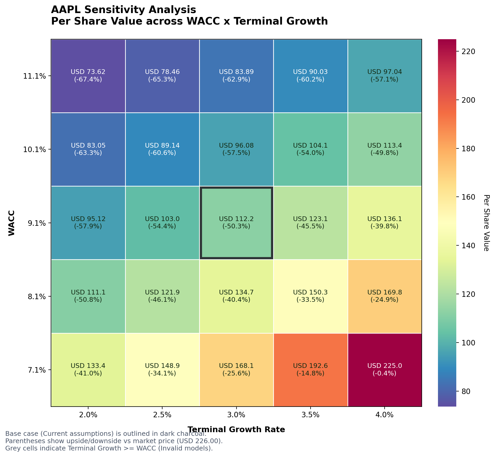

# FP-DCF

[English](./README.md) | [简体中文](./README.zh-CN.md)

面向 LLM Agent 与量化研究流程的第一性原理 DCF 估值引擎。

FP-DCF 专注做一件事：把公开财报与市场数据转成可审计的 `FCFF`、`WACC`、估值结果、隐含增长率与敏感性分析输出，而不是把会计口径与估值假设混在一起做成一个黑盒数字。



## 快速开始

安装并直接跑 sample：

```bash
python3 -m pip install .
python3 scripts/run_dcf.py --input examples/sample_input.json --pretty
```

这会返回结构化 JSON，并默认自动渲染 `png/svg` 敏感性热力图。

## 适合谁

* 需要机器可读估值输出的 agent / tool workflow
* 量化与主观研究流程
* 在意 `FCFF -> WACC -> DCF` 可审计逻辑的用户
* 需要 diagnostics、warnings、source labels 的下游系统

## 不适合谁

* 组合优化
* 交易执行
* 回测平台
* 黑盒式“一键一个数字”的估值工具
* 与估值无关的因子排序系统

## 为什么是 FP-DCF

相比很多开源 DCF 脚本，FP-DCF 的重点是：

* 将 `FCFF` 的经营税率与 `WACC` 的边际税率明确分离
* 使用显式的 `Delta NWC` 层级，而不是硬编码一个噪声很大的字段
* 支持可追踪的 FCFF 路径选择（`EBIAT` vs `CFO`）
* 支持规范化 anchor 模式（`latest`、`manual`、`three_period_average`、`reconciled_average`）
* 输出结构化 diagnostics、warnings 与 source labels，而不是只给一个结论数

## 你会得到什么

* 结构化估值 JSON
* `one_stage` / `two_stage` implied growth
* `WACC x Terminal Growth` 敏感性热力图
* 带本地缓存的 Yahoo normalization
* 适合下游工具消费的 machine-readable diagnostics

## 输出形状示意

```json
{
  "fcff": {
    "selected_path": "ebiat",
    "anchor_mode": "latest"
  },
  "valuation": {
    "enterprise_value": 1785801405103.29,
    "per_share_value": 112.25
  },
  "implied_growth": {
    "model": "one_stage",
    "one_stage": {
      "growth_rate": 0.0594
    }
  },
  "sensitivity": {
    "metric": "per_share_value"
  }
}
```

参考：

* [sample_input.json](./examples/sample_input.json)
* [sample_output.json](./examples/sample_output.json)
* [方法论文档](./references/methodology.md)
* [English](./README.md)

## 项目定位

这个仓库是更大 Yahoo / 市场数据 DCF 工作流的公开提炼层，边界刻意收窄，不是完整投研平台：

* 重点放在 valuation logic、input / output contract、以及 LLM-friendly packaging
* 不试图覆盖 portfolio optimizer、execution engine、backtesting system
* 更适合作为 downstream ranking、portfolio construction、agent orchestration 的上游模块

## 核心原则

### 1. 税率口径分离

* `FCFF` 应优先使用最合适的经营税率，通常是报表中的有效税率
* `WACC` 的债务税盾应使用边际税率
* 若发生 fallback，输出里必须明确来源

### 2. 稳健的 Delta NWC 处理

预期层级如下：

1. `OpNWC_delta`
2. `NWC_delta`
3. 由流动资产 / 流动负债反推的经营营运资本变化
4. 现金流量表中的 `ChangeInWorkingCapital` 一类字段

最终选用的来源必须在输出中说明。

### 3. 规范化 FCFF 锚点

对于 steady-state single-stage DCF：

* 不把历史 `FCFF` 直接当未来显式预测期
* 优先使用规范化 steady-state anchor
* 当驱动项充分时，优先走 `NOPAT + ROIC + reinvestment`
* 当经营驱动路径不完整时，再回退到规范化历史 `FCFF`
* `assumptions.fcff_anchor_mode` 默认是 `latest`，同时支持 `manual`、`three_period_average`、`reconciled_average`
* Yahoo-backed normalization 只暴露这些模式所需的最少量历史序列，并使用 `date:value` 字典表示

### 4. 市值口径的 WACC

目标 `WACC` 路径包括：

* 无风险利率
* 权益风险溢价
* Beta / Cost of Equity
* 税前债务成本
* 市值口径的股权与债务权重
* 使用边际税率的显式债务税盾

## 可执行入口

使用完整结构化输入运行：

```bash
python3 scripts/run_dcf.py --input examples/sample_input.json --pretty
```

安装后也可以使用打包 CLI：

```bash
fp-dcf --input examples/sample_input.json --pretty
```

如果你只有 ticker，希望程序自动从 Yahoo Finance 补齐主要估值输入，可以从下面开始：

```bash
cat > /tmp/fp_dcf_yahoo_input.json <<'JSON'
{
  "ticker": "AAPL",
  "market": "US",
  "provider": "yahoo",
  "statement_frequency": "A",
  "valuation_model": "steady_state_single_stage",
  "assumptions": {
    "terminal_growth_rate": 0.03
  }
}
JSON

python3 scripts/run_dcf.py --input /tmp/fp_dcf_yahoo_input.json --pretty
```

## 敏感性热力图

FP-DCF 默认会把精简版 `WACC x Terminal Growth` 敏感性摘要附加到主估值 JSON 中，并在同一次运行里自动渲染图表产物。

CLI 示例：

```bash
python3 scripts/run_dcf.py \
  --input /tmp/fp_dcf_yahoo_input.json \
  --output /tmp/aapl_output.json \
  --pretty
```

这一条命令会：

* 把估值 JSON 写到 `/tmp/aapl_output.json`
* 在 JSON 中附加精简版 `sensitivity` 摘要
* 自动渲染 `/tmp/aapl_output.sensitivity.svg`
* 自动渲染 `/tmp/aapl_output.sensitivity.png`

如果你想覆盖默认图表路径，也可以继续显式指定：

```bash
python3 scripts/run_dcf.py \
  --input /tmp/fp_dcf_yahoo_input.json \
  --output /tmp/aapl_output.json \
  --sensitivity-chart-output /tmp/aapl_sensitivity.svg \
  --pretty
```

也可以通过输入 JSON 驱动：

```json
{
  "sensitivity": {
    "metric": "per_share_value",
    "chart_path": "/tmp/aapl_sensitivity.svg",
    "wacc_range_bps": 200,
    "wacc_step_bps": 100,
    "growth_range_bps": 100,
    "growth_step_bps": 50
  }
}
```

如果你需要把完整数值网格也放进 JSON，可以显式开启：

```json
{
  "sensitivity": {
    "detail": true
  }
}
```

如果想在某次运行里关闭 sensitivity，可以用：

```bash
python3 scripts/run_dcf.py --input examples/sample_input.json --no-sensitivity --pretty
```

或者在 payload 中写：

```json
{
  "sensitivity": {
    "enabled": false
  }
}
```

默认热力图设置为：

* `metric=per_share_value`
* WACC 轴：基准值上下各 `200 bps`
* Terminal Growth 轴：基准值上下各 `100 bps`

当 terminal growth 大于等于 WACC 时，对应单元格会留空，并在 diagnostics 中说明。

## 隐含增长率反推

主 CLI 可以在不改变 `run_valuation()` 主逻辑的前提下，追加结构化 implied-growth 输出。

输入约定：

* 直接提供 `payload.market_inputs.enterprise_value_market`，或
* 提供 `payload.market_inputs.market_price`，再结合 `shares_out` 与 `net_debt` 推导 EV
* `payload.implied_growth.model` 支持 `one_stage` 与 `two_stage`

单阶段示例：

```json
{
  "market_inputs": {
    "market_price": 225.0
  },
  "implied_growth": {
    "model": "one_stage"
  }
}
```

两阶段示例：

```json
{
  "market_inputs": {
    "enterprise_value_market": 3500000000000.0
  },
  "implied_growth": {
    "model": "two_stage",
    "high_growth_years": 5,
    "stable_growth_rate": 0.03,
    "lower_bound": 0.0,
    "upper_bound": 0.25
  }
}
```

输出会追加：

* `market_inputs`：解析后的 market EV / equity value / price / shares / net debt 及其来源
* `implied_growth`：结构化求解结果

其中：

* `one_stage` 使用 closed-form 直接反推 implied growth
* `two_stage` 在固定 stable growth 的前提下，使用二分法反推 implied high-growth rate
* 如果启用了 implied growth，但 market inputs 不完整，CLI 会跳过 implied-growth 输出，而不会让主估值失败

## Provider 缓存

Yahoo-backed normalization 默认启用本地缓存，避免重复抓取相同请求形状下的 provider snapshot。

默认缓存目录：

```bash
~/.cache/fp-dcf
```

如果希望强制刷新 Yahoo 数据并覆盖缓存：

```bash
python3 scripts/run_dcf.py --input /tmp/fp_dcf_yahoo_input.json --pretty --refresh-provider
```

如果希望改用指定缓存目录：

```bash
python3 scripts/run_dcf.py --input /tmp/fp_dcf_yahoo_input.json --pretty --cache-dir /tmp/fp-dcf-cache
```

也可以在 JSON 输入中控制 normalization 行为：

```json
{
  "normalization": {
    "provider": "yahoo",
    "use_cache": true,
    "refresh": false,
    "cache_dir": "/tmp/fp-dcf-cache"
  }
}
```

provider-backed run 还会在 diagnostics 中输出缓存状态，例如：

* `provider_cache_miss:yahoo`
* `provider_cache_hit:yahoo`
* `provider_cache_refresh:yahoo`

## Structured output 方向

这个仓库首先面向机器可消费的结构化输出。典型返回结果形状如下：

```json
{
  "ticker": "AAPL",
  "market": "US",
  "valuation_model": "steady_state_single_stage",
  "tax": {
    "effective_tax_rate": 0.187,
    "marginal_tax_rate": 0.21
  },
  "wacc_inputs": {
    "risk_free_rate": 0.043,
    "equity_risk_premium": 0.05,
    "beta": 1.08,
    "pre_tax_cost_of_debt": 0.032,
    "wacc": 0.0912624
  },
  "capital_structure": {
    "equity_weight": 0.92,
    "debt_weight": 0.08,
    "source": "yahoo:market_value_using_total_debt"
  },
  "fcff": {
    "anchor": 106216000000.0,
    "anchor_method": "ebiat_plus_da_minus_capex_minus_delta_nwc",
    "selected_path": "ebiat",
    "anchor_ebiat_path": 106216000000.0,
    "anchor_cfo_path": null,
    "ebiat_path_available": true,
    "cfo_path_available": false,
    "after_tax_interest": null,
    "after_tax_interest_source": null,
    "reconciliation_gap": null,
    "reconciliation_gap_pct": null,
    "anchor_mode": "latest",
    "anchor_observation_count": 1,
    "delta_nwc_source": "OpNWC_delta"
  },
  "valuation": {
    "enterprise_value": 1785801405103.2935,
    "equity_value": 1739801405103.2935,
    "per_share_value": 112.24525194214796
  },
  "market_inputs": {
    "enterprise_value_market": 3533500000000.0,
    "enterprise_value_market_source": "derived_from_market_price_shares_out_and_net_debt",
    "equity_value_market": 3487500000000.0,
    "market_price": 225.0,
    "shares_out": 15500000000.0,
    "net_debt": 46000000000.0
  },
  "implied_growth": {
    "enabled": true,
    "model": "one_stage",
    "solver": "closed_form",
    "success": true,
    "enterprise_value_market": 3533500000000.0,
    "fcff_anchor": 106216000000.0,
    "wacc": 0.0912624,
    "one_stage": {
      "growth_rate": 0.05941663866081859
    },
    "two_stage": null
  },
  "diagnostics": [
    "tax_rate_paths_are_separated",
    "fcff_path_selector_only_ebiat_available",
    "fcff_path_selected:ebiat",
    "valuation_model_steady_state_single_stage"
  ]
}
```

更完整的例子见：

* [sample_input.json](./examples/sample_input.json)
* [sample_output.json](./examples/sample_output.json)

## 仓库结构

```text
FP-DCF/
├── README.md
├── README.zh-CN.md
├── SKILL.md
├── pyproject.toml
├── .gitignore
├── examples/
│   ├── sample_input.json
│   ├── sample_output.json
│   └── sample_output.sensitivity.png
├── scripts/
│   ├── plot_sensitivity.py
│   └── run_dcf.py
├── references/
│   └── methodology.md
├── tests/
└── fp_dcf/
```

## 安装

```bash
python3 -m pip install .
```

当前基础依赖包括：

* `numpy`
* `pandas`
* `yfinance`
* `matplotlib`

之所以把 `matplotlib` 作为基础依赖，是因为主 CLI 默认会渲染 `png/svg` 敏感性图表。

旧的 `.[viz]` 方式仍然可用，作为兼容别名：

```bash
python3 -m pip install .[viz]
```

本地开发与测试建议：

```bash
python3 -m pip install --upgrade pip
pip install -e .[dev]
```

运行可选的 Yahoo 实时集成测试：

```bash
FP_DCF_RUN_YAHOO_TESTS=1 pytest -q tests/test_yahoo_integration.py
```

## 当前限制

* Yahoo-backed normalization 仍依赖 provider 字段质量与可用性
* 缓存目前还没有 TTL 或 staleness policy
* 金融行业公司尚未有单独估值路径
* 当前只实现了 Yahoo 这一条 live normalization provider

## 贡献

开发环境、检查方式与 PR 约定见 [CONTRIBUTING.md](./CONTRIBUTING.md)。
